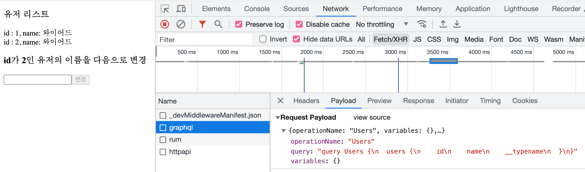
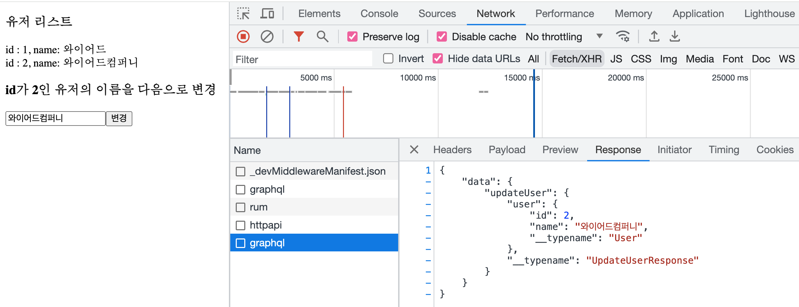
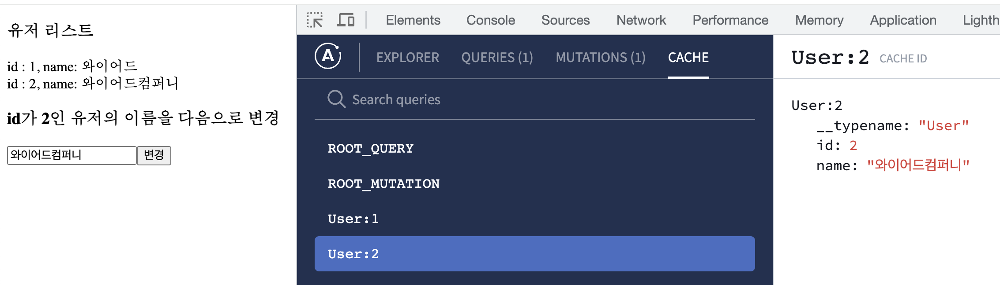

# Apollo Client에서 mutation의 response 데이터를 정규화하고 캐싱하는지 테스트

## 참고 내용
https://www.apollographql.com/docs/react/data/mutations#include-modified-objects-in-mutation-responses

**요약**
Apollo Client는 기본적으로 서버로부터 가져온 데이터의 `__typename`과 `id`를 조합하고 키로 사용해 캐싱한다.

캐싱은 mutation의 응답 데이터도 포함된다.

어떠한 중첩된 구조로 데이터가 넘어오더라도 `__typename`과 `id`을 기반으로 [정규화](https://www.apollographql.com/docs/react/caching/overview#data-normalization)하여 캐싱한다.

## 실행시 주의할점

비 serverless 환경에서 `next dev`나 `next start`로 실행해야 원하는대로 동작함

## 실행 결과

### users query


### users 캐싱됨


### user mutation


### mutation 응답이 기존 캐싱에 업데이트됨


---

This is a [Next.js](https://nextjs.org/) project bootstrapped with [`create-next-app`](https://github.com/vercel/next.js/tree/canary/packages/create-next-app).

## Getting Started

First, run the development server:

```bash
npm run dev
# or
yarn dev
# or
pnpm dev
```

Open [http://localhost:3000](http://localhost:3000) with your browser to see the result.

You can start editing the page by modifying `app/page.tsx`. The page auto-updates as you edit the file.

This project uses [`next/font`](https://nextjs.org/docs/basic-features/font-optimization) to automatically optimize and load Inter, a custom Google Font.

## Learn More

To learn more about Next.js, take a look at the following resources:

- [Next.js Documentation](https://nextjs.org/docs) - learn about Next.js features and API.
- [Learn Next.js](https://nextjs.org/learn) - an interactive Next.js tutorial.

You can check out [the Next.js GitHub repository](https://github.com/vercel/next.js/) - your feedback and contributions are welcome!

## Deploy on Vercel

The easiest way to deploy your Next.js app is to use the [Vercel Platform](https://vercel.com/new?utm_medium=default-template&filter=next.js&utm_source=create-next-app&utm_campaign=create-next-app-readme) from the creators of Next.js.

Check out our [Next.js deployment documentation](https://nextjs.org/docs/deployment) for more details.
